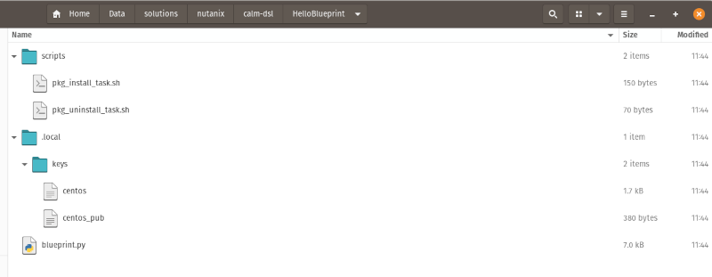

Decompiling Blueprints
######################

To make things easier, the blueprint for this section is going to be the exact same one used in the previous section.

In order to understand the steps in this section, it's first necessary to understand the structure of a Nutanix Calm DSL blueprint.  Take a look at the image below.

Here are the key components:

- “scripts” directory. This contains the scripts that are used at various stages during the blueprint deployment. In this example, there is a "pkg_install_task.sh" script that runs as part of the application deployment and a "pkg_uninstall_task.sh" script that runs when the application is destroyed.
- ".local" directory.  This hidden directory can be used to store credentials that apply to this blueprint but that should not be stored in source control.  If you were take a look at the files named `.local/keys/centos_pub` and `.local/keys/centos` you would see the Calm DSL has created a default SSH key pair for you.  As mentioned earlier, we'll leave these in place as it greatly simplifies today's lab.
- “blueprint.py”. This is the blueprint itself and ties together the code required by the DSL so that the blueprint can be deployed, launched (etc).

In a previous section, we ran the following command:

.. code-block:: bash

   calm init bp

That command generated a sample blueprint named **HelloBlueprint** while at the same time generating the files shown and explained above.

In the same section, we ran the following command immediately after generating the sample blueprint:

.. code-block:: bash

   calm create bp --file HelloBlueprint/blueprint.py

With the blueprint structure already in place, that command uploaded **HelloBlueprint** to Prism Central.

However, these specific commands don't allow us to work with existing blueprints that may have been created by an application designer; we can only create new ones.  Let's now look at working with existing blueprints.

.. note::

   Please make sure your Nutanix Calm DSL container is running and that the DSL has been configured using `calm init dsl`.

Method 1 - Prism Central
........................

Since **HelloBlueprint** has already been created and uploaded to Prism Central, we can use it as if it had been designed by someone else.

The first step in the decompilation process is to take the existing Prism Central blueprint and "dump" it to Calm DSL Python code using the Calm DSL itself.

#. Run the following command to dump **HelloBlueprint** to Calm DSL Python code.

   .. code-block:: bash

      calm decompile bp Hello

   .. note::

      The blueprint file uploaded in the previous step was named **HelloBlueprint**, but the actual application name is **Hello**.

   .. figure:: images/decompile_bp_from_pc.png

   Here is the process the Calm DSL went through:

   - Connected to Prism Central
   - Verified **Hello** exists
   - Started decompiling **Hello** to Calm DSL Python code
   - Formatted the Python code using `Black <https://github.com/psf/black>`_
   - Created `blueprint.py`

   Looking a bit closer, we can see the path to the decompiled blueprint is as follows:

   /root/Hello

   Taking that one step further and looking at the files that were created, we see the following:

   .. figure:: images/decompile_bp_from_pc_files.png

   The file list looks quite different from the file list generated using `calm init bp`, even though the blueprints are essentially the same.  Why?  The simple explanation is that only the required files are created when generating the sample blueprint, whereas the Calm DSL will dump all scripts required to programmatically edit a blueprint, even if they aren't explicitly used to run the application.

Method 2 - JSON File
....................

In some situations it may not be possible to access a Prism Central blueprint directly.  This means Method 1 above won't be available and the blueprint may have to be exported before you can work with it.

For example, an application designer may have create a blueprint in one environment, but needs to export it as JSON before the blueprint can be uploaded to production.  Let's simulate that now.

.. note::

   In important note for this section - because this lab is being completed using the Nutanix Calm DSL Docker container, we can't easily use the Calm UI to download the **Hello** blueprint as JSON.  For this reason, we will decompile it to Calm DSL Python code first, then "convert" it to JSON.  The resulting JSON will vary slightly from that generated by a UI download, but the key parts of the lab will be identical.

#. Within the Nutanix Calm DSL container, decompile the **Hello** blueprint using the same command we used earlier.

   .. code-block:: bash

      calm decompile bp Hello

   Within the container, the blueprint will be saved into `/root/Hello`, as shown in the command output:

   .. figure:: images/decompile_bp_from_pc.png

#. Without exiting the container, "convert" the blueprint to JSON by compiling the blueprint and sending the output to a local JSON file.

   .. code-block:: bash

      calm compile bp --file Hello/blueprint.py --out json > hello.json

#. The output from the command is empty, but that's because we redirected all output to the file `hello.json`.  We can look at the first few lines and make sure the process worked, as follows.

   .. code-block:: bash

      head -10 hello.json

   Looking at the output of those two commands together, we can see the contents of `hello.json` do in fact contain the **Hello** blueprint, but in JSON format:

   .. figure:: images/decompile_bp_from_pc_json.png

   The steps up to this point have prepared us to continue with this lab section's demonstration.

#. Within the Calm DSL container, run the following commands to remove the existing copy of the blueprint (Calm DSL Python code) then compile it from our new JSON file.

   .. code-block:: bash

      rm -Rf ./hello/
      calm decompile bp --file hello.json

   The main thing you'll notice is that the results are identical, regardless of whether we are decompiling from Calm DSL Python code or from exported/converted JSON.

   .. figure:: images/decompile_bp_from_pc_json_complete.png

   Even though we have technically repeated the compilation steps a couple of times, we now have a local copy of the **Hello** blueprint.  This blueprint can be directly edited as Python code, exactly how an automation engineer or developer would need to.

Summary
.......

This section of the lab covered the high-level specifics of blueprint decompilation:

- Decompiling a blueprint that already exists in a Prism Central instance
- Decompiling a blueprint that exists as a local JSON file

In the next section we'll wrap things up and summarise the takeaways from this lab.
